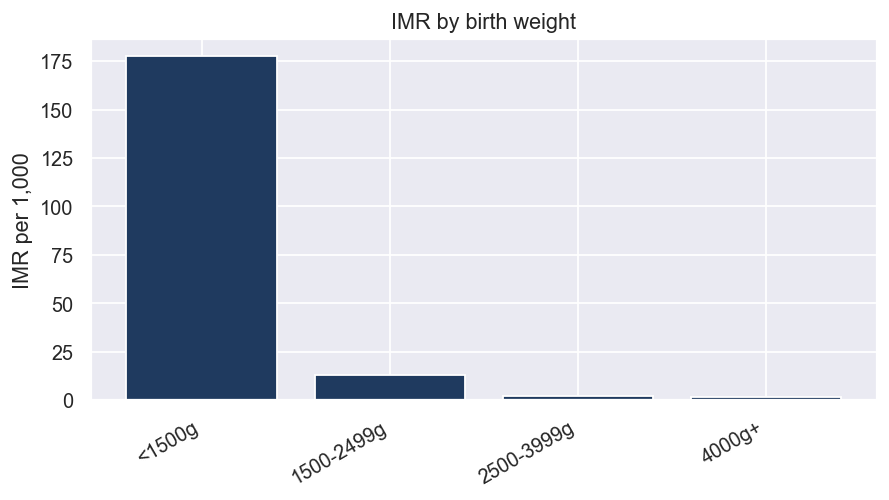
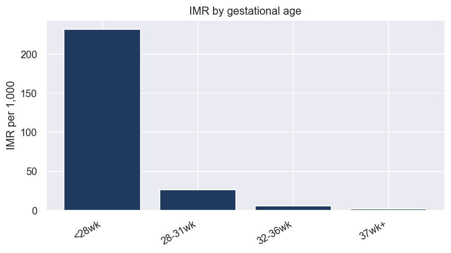
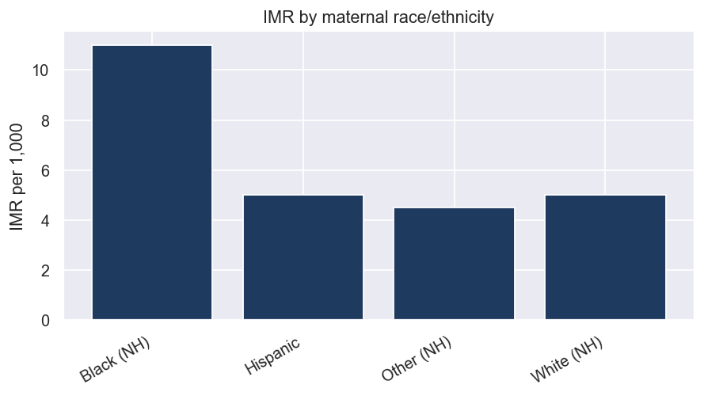
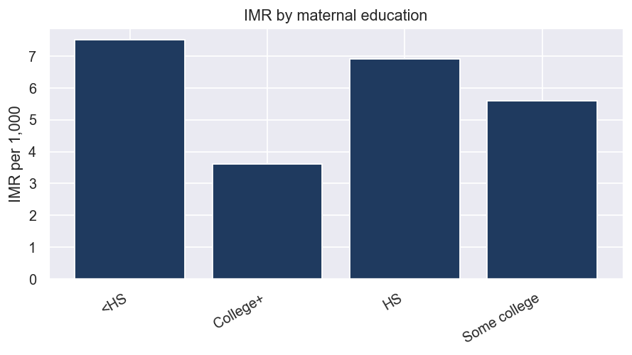
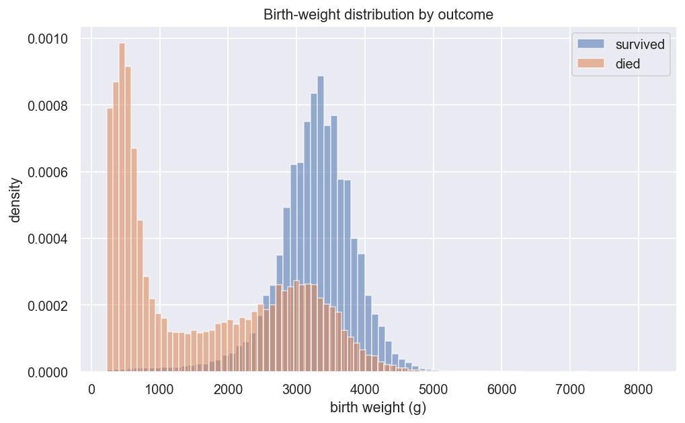
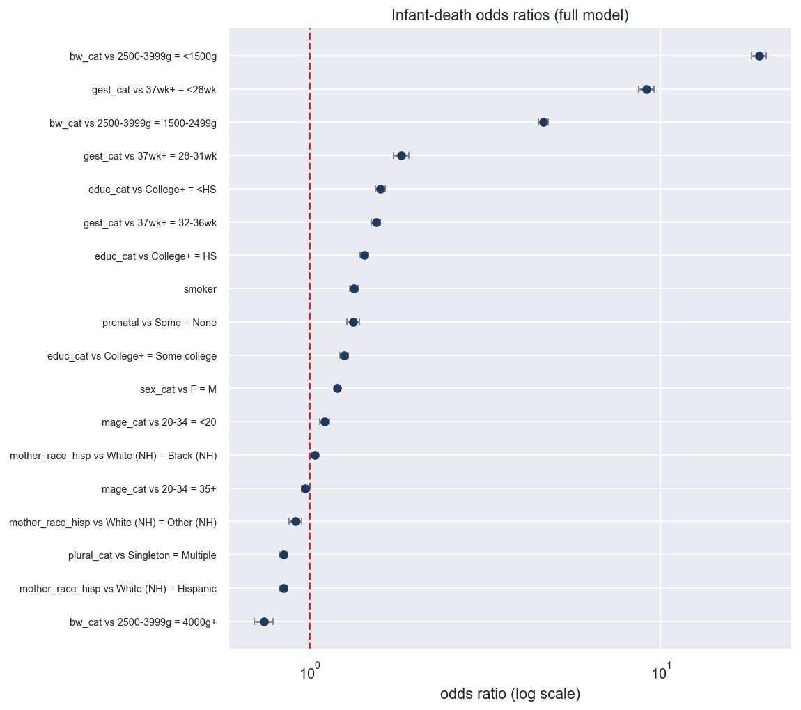
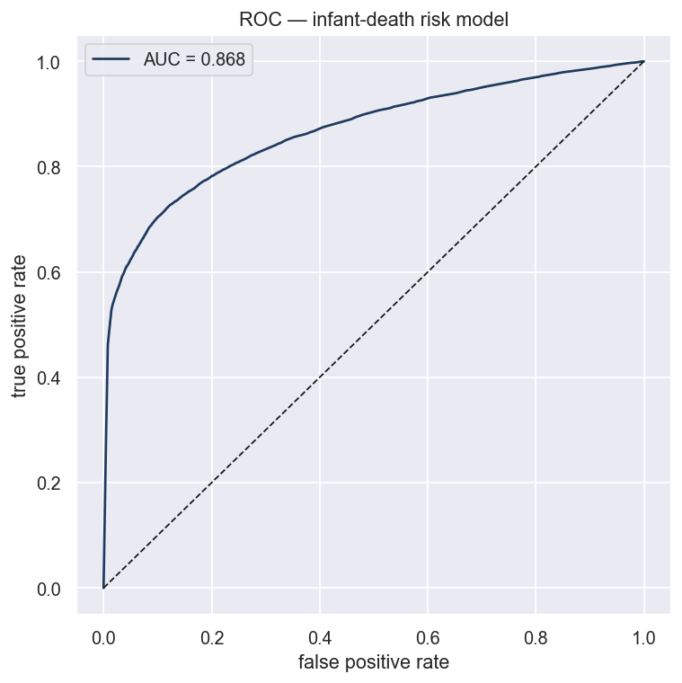

# Individual Infant-Mortality Risk — Microdata Analysis

Generated by `notebooks/06_microdata_risk.ipynb` (and `deep_microdata` run) on the
raw NCHS Period Linked Birth/Infant Death microdata, pooled over **2011–2013**.
Figures are in `figures/`, tables in `tables/`.

This is the **individual-level** counterpart to the aggregate rate analysis: one
row per birth, modeling *what makes a birth more likely to end in infant death*
rather than how the average rate moves over time.

## Data

- **11,933,189 births**, **70,409 infant deaths**, overall **IMR 5.9 per 1,000**.
- Complete-case modeling set: **9,744,584 births** (53,800 deaths).
- Observational; deaths are double-counted by ~0.6% (they also appear among the
  births), which slightly biases the intercept, not the gradients.

## Death rate by factor

**Birth weight is overwhelmingly the strongest factor** (`tables/tbl_imr_by_factor.csv`):

| Birth weight | IMR per 1,000 |
|---|---|
| < 1500 g | **177.5** |
| 1500–2499 g | 13.1 |
| 2500–3999 g | 2.1 |
| 4000 g+ | 1.5 |

Gestational age shows the same steep gradient (232 per 1,000 before 28 weeks → 2.0
at term): 

**Maternal race/ethnicity** — the well-known disparity is clear in the raw rates:

| Group | IMR per 1,000 |
|---|---|
| Black (NH) | **11.0** |
| White (NH) | 5.0 |
| Hispanic | 5.0 |
| Other (NH) | 4.5 |

 

The birth-weight distribution barely overlaps between outcomes — infants who die
are concentrated at very low weights: 

## Nested logistic-regression models

Risk built in three layers (`tables/tbl_model_comparison.csv`):

| Model | Pseudo-R² | AIC |
|---|---|---|
| 1 — birth factors (weight, gestation, plurality, sex) | 0.286 | 475,998 |
| 2 — + maternal (age, smoking) | 0.288 | 474,675 |
| 3 — + social (education, race, prenatal care) | 0.290 | 473,356 |

Both expansions are highly significant by likelihood-ratio test (p ≈ 0), but the
**pseudo-R² barely moves** — birth factors alone explain almost all of the
explainable variation. A textbook case of statistical vs. practical significance.

## Odds ratios (full model)

Selected adjusted odds ratios (`tables/tbl_odds_ratios.csv`, reference in parentheses):

| Predictor | OR | 95% CI |
|---|---|---|
| Birth weight < 1500 g (vs 2500–3999) | **19.1** | 18.1–20.0 |
| Birth weight 1500–2499 g | 4.6 | 4.5–4.8 |
| Birth weight 4000 g+ | 0.74 | 0.70–0.79 |
| Gestation < 28 wk (vs 37+) | **9.1** | 8.7–9.6 |
| Gestation 28–31 wk | 1.82 | 1.73–1.92 |
| Gestation 32–36 wk | 1.55 | 1.50–1.59 |
| Education < HS (vs College+) | 1.59 | 1.54–1.64 |
| No prenatal care (vs some) | 1.33 | 1.28–1.39 |
| Smoker | 1.34 | 1.30–1.37 |
| Male infant (vs female) | 1.20 | 1.18–1.22 |
| Mother < 20 (vs 20–34) | 1.10 | 1.07–1.14 |
| **Black NH (vs White NH)** | **1.03** | 1.01–1.06 |
| Hispanic (vs White NH) | 0.84 | 0.82–0.86 |

**The headline finding:** the crude Black–White gap is ~2× (11.0 vs 5.0 per
1,000), but **after adjusting for birth weight, gestation, education, and prenatal
care the Black–White odds ratio collapses to ~1.03.** The disparity operates
almost entirely *through* higher rates of preterm/low-birth-weight delivery and
socioeconomic disadvantage, not through race conditional on those factors. The
lower Hispanic risk (OR 0.84) is the well-documented "Hispanic paradox."

## Discrimination

A model trained on 70% and tested on 30% achieves **ROC-AUC = 0.868** — strong
discrimination, driven almost entirely by birth weight and gestational age.

## Takeaways

- **Birth weight and gestational age dominate** infant-mortality risk by an order
  of magnitude over every social factor.
- The **racial disparity is largely mediated** by prematurity/low birth weight and
  socioeconomic factors — adjusting for them removes almost all of the Black–White
  gap. This points interventions toward the causes of preterm birth, not race.
- Social factors (education, smoking, prenatal care) are real and significant but
  add little once birth factors are accounted for.
- Birth weight and gestation are highly collinear; their coefficients should be
  read together, and none of this is causal (observational data).
